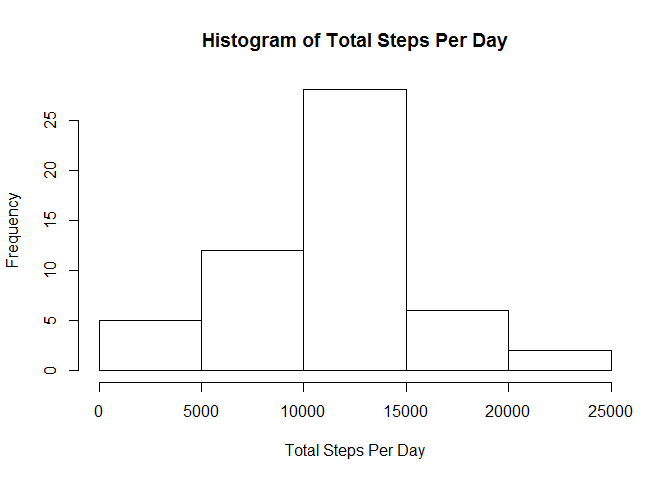
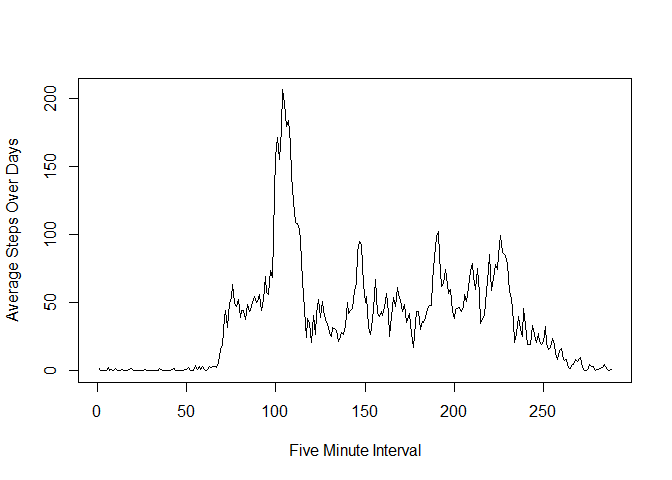
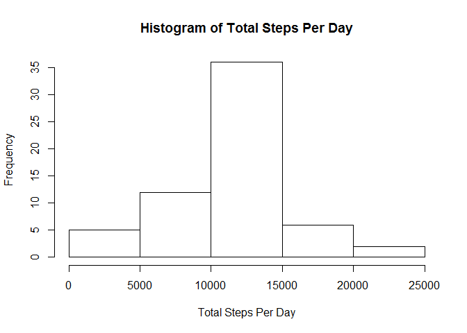
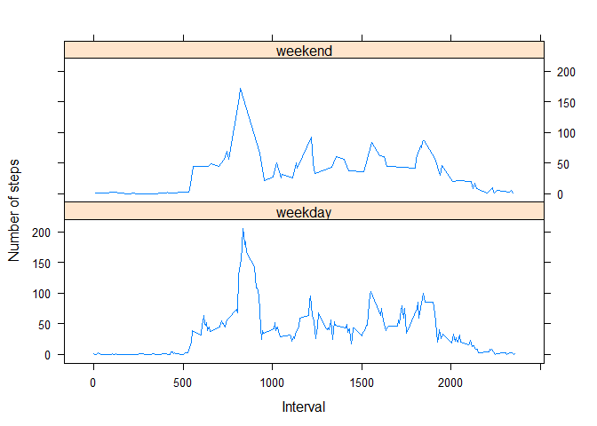

# Reproducible Research: Peer Assessment 1


## Loading and preprocessing the data
I loaded data with read.csv(), straight out of the zip file using unz(). I decided I did not need to do any preprocessing. I can just use the data as is. 

```r
activity <- read.csv(unz("activity.zip", "activity.csv"))
```


## What is mean total number of steps taken per day?
Here is a histogram of different numbers of steps taken each day, and calculations of the mean and median number of steps taken each day.

```r
totsperday <- tapply(activity$steps, activity$date, sum)
hist(totsperday, main = "Histogram of Total Steps Per Day", xlab = "Total Steps Per Day")
```

 

```r
mean(totsperday, na.rm=TRUE)
```

```
## [1] 10766.19
```

```r
median(totsperday, na.rm=TRUE)
```

```
## [1] 10765
```

## What is the average daily activity pattern?
Here is a time series for the average number of steps taken in each interval, averaged across days.

```r
avgperint <- tapply(activity$steps, activity$interval, mean, na.rm=TRUE)
plot(avgperint, type = "l", xlab = "Five Minute Interval", ylab = "Average Steps Over Days")
```

 

In what interval are the most steps being taken?

```r
which(avgperint == max(avgperint))
```

```
## 835 
## 104
```
So, the 104th interval, between minute 835 and 840, is the most walked time of day, on average.

## Imputing missing values

How many NAs are there?

```r
sum(is.na(activity$steps))
```

```
## [1] 2304
```


My avgperind variable is currently a list, and I need to make a matrix out of it in order to merge it with the other data. Then I can use conditional testing to throw the averages into the steps column only if an NA is currently in that place. Then I cut off the unnecessary column leftover from the merge. Finally, I give a histogram and recalculate the mean and median of total number of steps per day.

```r
avgperintmatrix <- cbind(as.numeric(names(avgperint)), as.numeric(avgperint))
activity2 <- merge(activity, avgperintmatrix, by.x = 3, by.y = 1)
activity2$steps <- ifelse(is.na(activity2$steps), activity2$V2, activity2$steps)
activity2 <- activity2[-4]
totsperday2 <- tapply(activity2$steps, activity2$date, sum)
hist(totsperday2, main = "Histogram of Total Steps Per Day", xlab = "Total Steps Per Day")
```

 

```r
mean(totsperday2)
```

```
## [1] 10766.19
```

```r
median(totsperday2)
```

```
## [1] 10766.19
```
They are very close.

## Are there differences in activity patterns between weekdays and weekends?


```r
dayend <- ifelse(weekdays(as.Date(activity2$date)) %in% c("Saturday", "Sunday"), "weekend", "weekday")
activity2 <- cbind(activity2, dayend)
library(lattice)
xyplot(tapply(steps,interval,mean) ~ unique(interval) | dayend, activity2, type = "l", layout = c(1,2), xlab = "Interval", ylab = "Number of steps")
```

 

They actually look pretty similar, which I was not expecting.
